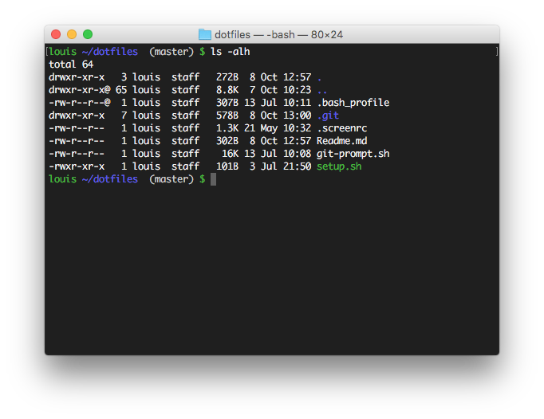

## Dotfiles

A nice coloured bash prompt with Git status.

### Install

Clone the repo in your home folder: `cd ~/ && git clone git@github.com:louisnorthmore/dotfiles.git`  
Run `setup.sh` from your home folder: `cd ~/ && ./setup.sh`  

### Features

Customized .screenrc  
Customized .bash_profile

